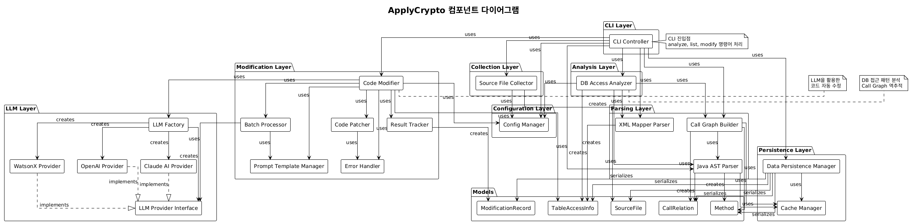
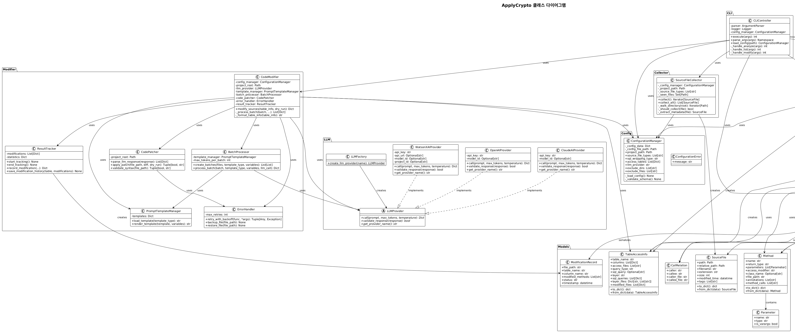

# ApplyCrypto

Java Spring Boot 프로젝트 암호화 자동 적용 도구

## 개요

ApplyCrypto는 Java Spring Boot 기반 레거시 시스템에서 민감한 개인정보를 데이터베이스에 암호화하여 저장하도록 소스 코드를 자동으로 분석하고 수정하는 AI 기반 개발 도구입니다.

## 아키텍처

ApplyCrypto는 계층형 아키텍처로 설계되어 있으며, 각 레이어는 명확한 책임을 가집니다. 아래 다이어그램은 전체 시스템 구조를 시각화합니다.

### 컴포넌트 구조



**주요 컴포넌트 및 레이어:**

다이어그램은 8개의 주요 레이어로 구성되어 있으며, 각 레이어는 명확한 책임을 가집니다:

1. **CLI Layer** - 사용자 인터페이스 및 명령어 처리
   - `CLIController`: analyze, list, modify 명령어를 파싱하고 실행
   - 모든 하위 레이어를 조율하여 전체 워크플로우 관리

2. **Configuration Layer** - 설정 관리
   - `ConfigurationManager`: JSON 설정 파일 로드, 스키마 검증, 타입 안전한 설정값 제공
   - 프로젝트 경로, 파일 타입, SQL 래핑 타입, 암호화 대상 테이블/칼럼 정보 관리

3. **Collection Layer** - 소스 파일 수집
   - `SourceFileCollector`: 프로젝트 내 소스 파일을 재귀적으로 탐색하고 메타데이터 추출
   - 제외 디렉터리/파일 패턴 필터링, 중복 제거, 제너레이터 패턴으로 메모리 효율성 확보

4. **Parsing Layer** - 소스 코드 파싱
   - `JavaASTParser`: tree-sitter를 사용하여 Java 소스 코드를 AST로 파싱, 클래스/메서드 정보 추출
   - `XMLMapperParser`: lxml을 사용하여 MyBatis Mapper XML 파일 파싱, SQL 쿼리 및 테이블/칼럼 정보 추출
   - `CallGraphBuilder`: NetworkX를 사용하여 메서드 호출 관계 그래프 생성, REST API 엔드포인트 식별

5. **Analysis Layer** - DB 접근 패턴 분석
   - `DBAccessAnalyzer`: 설정된 테이블/칼럼에 접근하는 소스 파일 식별
   - Call Graph를 역추적하여 Controller → Service → DAO → Mapper 레이어 경로 추적

6. **Modification Layer** - 코드 자동 수정
   - `CodeModifier`: LLM을 활용한 암호화 코드 자동 삽입의 메인 오케스트레이터
   - `BatchProcessor`: 대량 파일을 효율적으로 처리하기 위한 배치 최적화
   - `CodePatcher`: LLM 응답을 unified diff 형식으로 파싱하여 실제 코드 변경 적용
   - `ErrorHandler`: 자동 재시도, 백업/롤백 기능 제공
   - `ResultTracker`: 수정 이력 추적 및 통계 수집
   - `PromptTemplateManager`: 레이어별 최적화된 LLM 프롬프트 템플릿 관리

7. **LLM Layer** - AI 모델 연동
   - `LLMProvider`: 추상 인터페이스 (call, validate_response, get_provider_name)
   - `LLMFactory`: 설정에 따라 적절한 LLM 프로바이더 생성
   - `WatsonXAIProvider`, `OpenAIProvider`, `ClaudeAIProvider`: 다양한 LLM 프로바이더 구현

8. **Persistence Layer** - 데이터 영속화
   - `DataPersistenceManager`: 분석 결과를 JSON 형식으로 직렬화/역직렬화
   - `CacheManager`: 파싱 결과를 캐싱하여 성능 최적화

**컴포넌트 간 의존성 흐름:**

다이어그램에서 표현된 주요 의존성 관계:

1. **CLI → 모든 레이어**: `CLIController`는 모든 주요 컴포넌트를 조율하여 전체 워크플로우를 관리합니다
2. **Collection → Config**: 설정 기반 파일 필터링 및 수집
3. **Parsing → Cache**: 파싱 결과 캐싱으로 성능 최적화
4. **Analysis → Parsing**: 파싱 결과를 활용하여 DB 접근 경로 추적
5. **Modification → LLM**: LLM Layer를 통해 AI 기반 코드 수정 수행
6. **Persistence → Models**: 모든 데이터 모델을 JSON 형식으로 영속화

**주요 설계 패턴:**
- **전략 패턴**: LLM Provider 인터페이스를 통한 다양한 AI 모델 지원
- **팩토리 패턴**: LLMFactory를 통한 프로바이더 생성
- **캐싱 패턴**: CacheManager를 통한 파싱 결과 재사용
- **템플릿 패턴**: PromptTemplateManager를 통한 프롬프트 관리

### 클래스 구조



**주요 클래스 및 패키지:**

다이어그램은 패키지별로 클래스를 그룹화하여 구조를 명확히 표현합니다:

**CLI 패키지:**
- `CLIController`: CLI 명령어 파싱 및 실행, analyze/list/modify 핸들러 제공

**Config 패키지:**
- `ConfigurationManager`: JSON 설정 파일 관리, 스키마 검증, 프로젝트 설정 제공
- `ConfigurationError`: 설정 관련 예외 처리

**Collector 패키지:**
- `SourceFileCollector`: 소스 파일 수집 및 메타데이터 추출

**Parser 패키지:**
- `JavaASTParser`: Java AST 파싱, 클래스/메서드 정보 추출
- `ClassInfo`: 파싱된 클래스 정보 저장
- `XMLMapperParser`: MyBatis XML 파싱, SQL 쿼리 정보 추출
- `SQLQuery`: SQL 쿼리 정보 저장
- `CallGraphBuilder`: Call Graph 생성, 엔드포인트 식별, 호출 체인 추적
- `Endpoint`: REST API 엔드포인트 정보 저장

**Analyzer 패키지:**
- `DBAccessAnalyzer`: DB 접근 패턴 분석, Call Graph 역추적

**Modifier 패키지:**
- `CodeModifier`: LLM 기반 코드 수정 오케스트레이션
- `BatchProcessor`: 배치 처리 최적화
- `CodePatcher`: 코드 패치 적용 및 검증
- `ErrorHandler`: 오류 처리 및 재시도
- `ResultTracker`: 수정 이력 추적
- `PromptTemplateManager`: 프롬프트 템플릿 관리

**LLM 패키지:**
- `LLMProvider`: 추상 기본 클래스
- `LLMFactory`: 프로바이더 팩토리
- `WatsonXAIProvider`, `OpenAIProvider`, `ClaudeAIProvider`: 구체적인 LLM 구현

**Persistence 패키지:**
- `DataPersistenceManager`: 데이터 영속화 관리
- `CacheManager`: 캐시 관리

**Models 패키지:**
- `SourceFile`: 소스 파일 메타데이터
- `TableAccessInfo`: 테이블 접근 정보
- `Method`, `Parameter`: 메서드 정보
- `CallRelation`: 메서드 호출 관계
- `ModificationRecord`: 수정 이력 기록

**주요 클래스 관계 및 설계 패턴:**

다이어그램에서 표현된 클래스 간 관계:

1. **의존성 관계 (→)**
   - `CLIController` → 모든 주요 컴포넌트: 전체 워크플로우 조율
   - `DBAccessAnalyzer` → `CallGraphBuilder`, `XMLMapperParser`, `JavaASTParser`: DB 접근 경로 분석
   - `CodeModifier` → `LLMProvider`, `BatchProcessor`, `CodePatcher`: 코드 수정 오케스트레이션
   - `DataPersistenceManager` → 모든 Models: 데이터 영속화

2. **생성 관계 (creates)**
   - `SourceFileCollector` → `SourceFile`: 소스 파일 메타데이터 생성
   - `JavaASTParser` → `Method`, `CallRelation`: 파싱 결과 생성
   - `XMLMapperParser` → `TableAccessInfo`: 테이블 접근 정보 생성
   - `ResultTracker` → `ModificationRecord`: 수정 이력 기록 생성

3. **구현 관계 (..|>)**
   - `WatsonXAIProvider`, `OpenAIProvider`, `ClaudeAIProvider` ..|> `LLMProvider`: 전략 패턴 구현

4. **포함 관계 (contains)**
   - `Method` → `Parameter`: 메서드가 파라미터를 포함

**설계 원칙:**
- **단일 책임 원칙**: 각 클래스는 하나의 명확한 책임을 가집니다
- **의존성 역전 원칙**: 추상 인터페이스(`LLMProvider`)를 통한 의존성 주입
- **개방-폐쇄 원칙**: 새로운 LLM 프로바이더 추가 시 기존 코드 수정 없이 확장 가능
- **관심사의 분리**: 레이어별로 명확히 분리된 책임

## 설치

```bash
# 가상환경 생성
python -m venv venv

# 가상환경 활성화
source venv/bin/activate  # Linux/macOS
# 또는
venv\Scripts\activate  # Windows

# 의존성 설치
pip install -r requirements.txt
```

## 개발 환경 설정

```bash
# 개발 의존성 포함 설치
pip install -e ".[dev]"
```

## 테스트 실행

```bash
# 모든 테스트 실행
pytest

# 커버리지 포함 테스트
pytest --cov=src --cov-report=html
```

## 프로젝트 구조

```
samsung-life/
├── src/
│   ├── cli/                    # CLI 인터페이스
│   │   └── cli_controller.py
│   ├── config/                 # 설정 관리
│   │   └── config_manager.py
│   ├── collector/              # 소스 파일 수집
│   │   └── source_file_collector.py
│   ├── parser/                 # 코드 파싱
│   │   ├── java_ast_parser.py
│   │   ├── xml_mapper_parser.py
│   │   └── call_graph_builder.py
│   ├── analyzer/               # DB 접근 분석
│   │   ├── db_access_analyzer.py
│   │   └── sql_parsing_strategy.py
│   ├── modifier/               # 코드 수정
│   │   ├── code_modifier.py
│   │   ├── batch_processor.py
│   │   ├── code_patcher.py
│   │   ├── error_handler.py
│   │   ├── result_tracker.py
│   │   ├── prompt_template_manager.py
│   │   └── llm/                # LLM 프로바이더
│   │       ├── llm_provider.py
│   │       ├── llm_factory.py
│   │       ├── watsonx_provider.py
│   │       ├── openai_provider.py
│   │       └── claude_ai_provider.py
│   ├── persistence/             # 데이터 영속화
│   │   ├── data_persistence_manager.py
│   │   ├── cache_manager.py
│   │   ├── json_encoder.py
│   │   ├── json_decoder.py
│   │   └── schemas.py
│   └── models/                 # 데이터 모델
│       ├── source_file.py
│       ├── table_access_info.py
│       ├── method.py
│       ├── call_relation.py
│       └── modification_record.py
├── docs/                       # 문서 및 다이어그램
│   ├── component_diagram.puml  # 컴포넌트 다이어그램 소스
│   ├── component_diagram.png    # 컴포넌트 다이어그램 이미지
│   ├── class_diagram.puml      # 클래스 다이어그램 소스
│   ├── class_diagram.png        # 클래스 다이어그램 이미지
│   ├── render_diagrams.py       # Python 렌더링 스크립트
│   └── render_diagrams.sh       # Bash 렌더링 스크립트
├── tests/                       # 테스트 코드
├── main.py                      # CLI 진입점
├── config.example.json          # 예제 설정 파일
├── requirements.txt
├── pyproject.toml
└── README.md
```

## 주요 기능

### 1. 프로젝트 분석 (analyze)

- **소스 파일 수집**: 설정된 확장자(.java, .xml 등)의 모든 소스 파일을 재귀적으로 탐색
- **Java AST 파싱**: tree-sitter를 사용하여 Java 소스 코드를 파싱하고 클래스/메서드 정보 추출
- **XML Mapper 파싱**: MyBatis Mapper XML 파일에서 SQL 쿼리 및 테이블/칼럼 정보 추출
- **Call Graph 생성**: 메서드 호출 관계를 그래프로 구성하고 REST API 엔드포인트 식별
- **DB 접근 분석**: 설정된 테이블/칼럼에 접근하는 파일을 Call Graph 역추적을 통해 식별

### 2. 정보 조회 (list)

- **소스 파일 목록**: 수집된 모든 소스 파일 조회
- **DB 접근 정보**: 테이블별 접근 파일 목록 및 상세 정보
- **엔드포인트 목록**: 식별된 REST API 엔드포인트 목록
- **호출 그래프**: 특정 엔드포인트의 메서드 호출 체인 시각화
- **수정 이력**: 암호화 코드가 적용된 파일 목록

### 3. 코드 수정 (modify)

- **자동 코드 삽입**: LLM을 활용하여 식별된 파일에 암호화/복호화 코드 자동 삽입
- **레이어별 처리**: Controller, Service, DAO, Mapper 레이어별로 최적화된 코드 수정
- **배치 처리**: 대량 파일을 효율적으로 처리하기 위한 배치 최적화
- **Dry-run 모드**: 실제 수정 없이 미리보기만 수행
- **오류 처리**: 자동 재시도 및 롤백 기능

## 워크플로우

1. **설정 파일 준비**: `config.json`에 암호화 대상 테이블/칼럼 정보 설정
2. **프로젝트 분석**: `analyze` 명령어로 소스 파일 수집 및 DB 접근 패턴 분석
3. **결과 확인**: `list` 명령어로 분석 결과 확인
4. **코드 수정**: `modify` 명령어로 암호화 코드 자동 적용 (dry-run 모드로 먼저 확인 가능)

## 사용 예시

### CLI 사용

```bash
# 프로젝트 분석
python main.py analyze --config config.json

# 모든 소스 파일 목록 조회
python main.py list --all

# 테이블별 접근 파일 목록 조회
python main.py list --db

# REST API 엔드포인트 목록 조회
python main.py list --endpoint

# 특정 엔드포인트의 호출 그래프 조회
python main.py list --callgraph EmpController.login

# 수정된 파일 목록 조회
python main.py list --modified

# 파일 수정 (미리보기)
python main.py modify --config config.json --dry-run

# 파일 수정 (실제 수정)
python main.py modify --config config.json
```

### 설정 파일 예시 (config.json)

```json
{
  "target_project": "/path/to/spring-boot-project",
  "source_file_types": [".java", ".xml"],
  "sql_wrapping_type": "mybatis",
  "llm_provider": "watsonx_ai",
  "access_tables": [
    {
      "table_name": "employee",
      "columns": [
        {"name": "ssn", "new_column": false},
        {"name": "phone", "new_column": false},
        {"name": "email", "new_column": false}
      ]
    }
  ],
  "exclude_dirs": ["test", "generated"],
  "exclude_files": ["*Test.java", "*_test.java"]
}
```

### Python API 사용

```python
from src.config.config_manager import ConfigurationManager
from src.collector.source_file_collector import SourceFileCollector
from src.analyzer.db_access_analyzer import DBAccessAnalyzer

# 설정 파일 로드
config_manager = ConfigurationManager("config.json")

# 소스 파일 수집
collector = SourceFileCollector(config_manager)
source_files = list(collector.collect())

# DB 접근 분석
analyzer = DBAccessAnalyzer(config_manager)
table_access_info = analyzer.analyze(source_files)
```

## 기술 스택

- **언어**: Python 3.13+
- **파싱**: tree-sitter (Java AST 파싱), lxml (XML 파싱)
- **그래프 분석**: NetworkX (Call Graph 구성)
- **AI 모델**: WatsonX.AI, OpenAI, Claude AI
- **데이터 직렬화**: JSON with custom encoder/decoder


